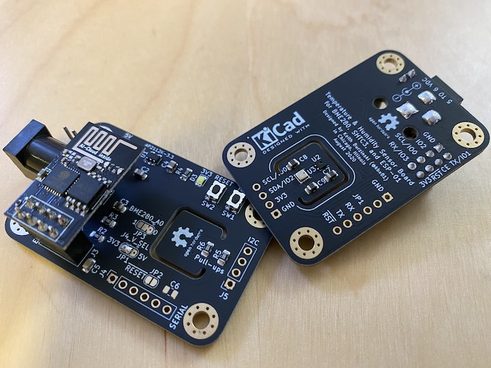

# kbx's Temperature and Humidity Sensor Board for ESP-01

## What?

Just another environmental sensor board to plug an ESP-01 module onto.
 It was designed with [ESPHome](https://esphome.io) in mind but should work fine
 with [Tasmota](https://tasmota.github.io/docs/) or any other app, really.

## Why?

I needed a sensor board to monitor the humidity in my filament storage box.
 I was somewhat unhappy with the tiny DHT22 boards that are typically available
 on Amazon and elsewhere so I spun my own version. The dual-sensor arrangement
 allows for some redundancy -- they, in a sense, verify each other to help
 increase confidence in the readings/data they provide.

The board itself is sized to align with extra mounting holes that seem to be
 in the Prusa MK3 frame. With the help of the [spacer](BME280+SHTC3BoardMountForPrusaMK3.stl)
 I drew up, it should be possible to mount it directly to the printer's frame
 with just two M3 screws from your "spare parts" baggy. I've done this to monitor
 the temperature inside of the LACK enclosure I built for my printer with the help
 of [Home Assistant](https://www.home-assistant.io), [ESPHome](https://esphome.io)
 and [Grafana](https://grafana.com). This board can be powered from a spare 5-volt
 header that's near the top of the MK3's RAMbo board (the cable is visible in the
 pictures I've placed into the [images](images/) directory).

## How?

Please see the BoM [here](TempHumSensWithESP01.bom.csv) or
 [here](https://octopart.com/bom-tool/L01oa2CK) for a list of parts needed to
 build one. I had the PCBs fabricated by [Elecrow](https://www.elecrow.com) but
 nearly any PCB fabricator should be able to manufacture these without any issues.

The schematic and PCB were drawn in [KiCAD](https://www.kicad-pcb.org).

The BME280 is the most challenging part on this board -- the pads are on the
 underside of the device. You'll need a steady hand and either a hot air station
 or a reflow oven to solder this part to the board. The rest of the components are
 pretty easy to work with.

Note that `R7` is optional; you can use it as a pull-up resistor in the event that
 you'd like to connect a DHTxx module to the RX/GPIO3 line on the ESP-01. Why?
 Because more sensors...duh...

 ## Legal stuff and License

The circuit schematics and PCB found here are licensed under the
 [Creative Commons Attribution-ShareAlike 4.0 International License](http://creativecommons.org/licenses/by-sa/4.0/).

_Happy building!_